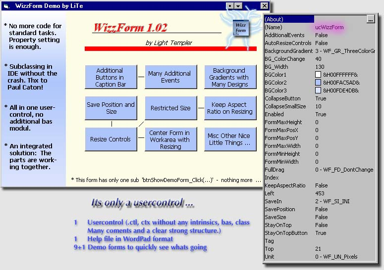



## WizzForm \- An integrated solution by LiTe

### Description

This selfcontained usercontrol adds often needed functions to VBs forms. Just setting more properties here instead of the forms properties box. I put the spot onto the integration, the working together of functions you normaly have separated. Started on June 2004 this larger project has a long historie and is used in very stable apps. You find a longer list with detailed credits (Paul Caton, Bryan Stafford, Carles P.V. and more) in code and ReadMe file. Theres a lot of time and some nice solutions in. Plz check it out (9 demo forms included to play with), tell me what you mean and maybe you like to vote for it ;-) 

----

Oct 2005 - Light Templer
 
### More Info
 

             |
---                |---
**Submitted On**   |2005-02-01 13:58:38
**By**             |[Light Templer](https://github.com/Planet-Source-Code/PSCIndex/blob/master/ByAuthor/light-templer.md)
**Level**          |Intermediate
**User Rating**    |5.0 (175 globes from 35 users)
**Compatibility**  |VB 5\.0, VB 6\.0
**Category**       |[VB function enhancement](https://github.com/Planet-Source-Code/PSCIndex/blob/master/ByCategory/vb-function-enhancement__1-25.md)
**World**          |[Visual Basic](https://github.com/Planet-Source-Code/PSCIndex/blob/master/ByWorld/visual-basic.md)
**Archive File**   |[WizzForm\_\-19399510132005\.zip](https://github.com/Planet-Source-Code/light-templer-wizzform-an-integrated-solution-by-lite__1-62872/archive/master.zip)

